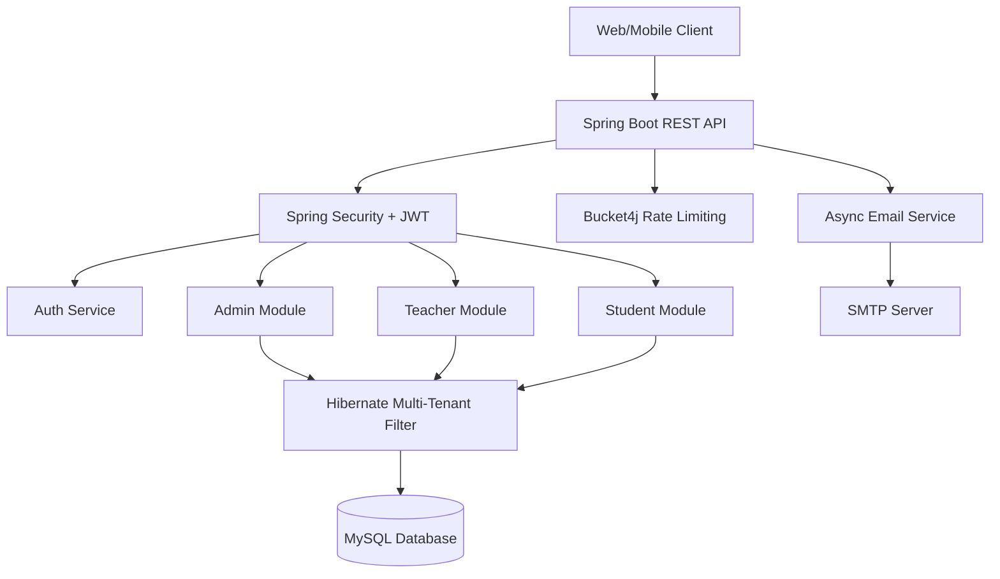

# Manger — School ERP System

A production-ready, multi-tenant School Enterprise Resource Planning (ERP) system built with Spring Boot 3.5 and MySQL. Manger is designed to handle multiple schools concurrently, securely isolating data while providing distinct portals for Administrators, Teachers, and Students.

## 🚀 Features

- **Multi-Tenancy**: Built-in data isolation per school using Hibernate `@Filter`.
- **Role-Based Access Control (RBAC)**: Distinct authentication flows and authorization for Admins, Teachers, and Students via JWT.
- **Academic Management**: Comprehensive modules for Attendance, Exams, Grading, Timetables, and Classrooms.
- **Student Risk Analysis**: Automated risk scoring based on attendance drops and academic performance.
- **Resilient Infrastructure**: 
  - Rate limiting on authentication endpoints (Bucket4j).
  - Asynchronous, fault-tolerant email notifications with DB audit logging.
  - Optimized database schemas with composite indexes for fast querying.
- **Automated Document Generation**: PDF generation for Marksheets and ID cards.

## 🛠️ Tech Stack

- **Backend**: Java 17+, Spring Boot 3.5 (Web, Data JPA, Security, Mail, Validation)
- **Database**: MySQL 8+
- **Security**: Spring Security, JWT (JSON Web Tokens)
- **Rate Limiting**: Bucket4j
- **Documentation**: Swagger (Springdoc OpenAPI)
- **Testing**: JUnit 5, Mockito

## 🏗️ Architecture



## ⚙️ Local Development

### Prerequisites
- JDK 17 or higher
- MySQL 8.0+
- Maven

### Environment Variables
Configure these in your `application.properties` or environment:

| Variable | Description |
|----------|-------------|
| `spring.datasource.url` | MySQL connection string |
| `spring.datasource.username` | Database username |
| `spring.datasource.password` | Database password |
| `jwt.secret` | Secret key for JWT signing |
| `spring.mail.username` | SMTP username (e.g., Gmail) |
| `spring.mail.password` | SMTP App Password |

### Running the Application

1. Clone the repository
2. Ensure MySQL is running and create the database `manger_db`
3. Build the project:
   ```bash
   ./mvnw clean install
   ```
4. Run the application:
   ```bash
   ./mvnw spring-boot:run
   ```

The application will start on `http://localhost:8080`.

## 📚 API Documentation

Once running, access the interactive Swagger UI API documentation at:
`http://localhost:8080/swagger-ui.html`
