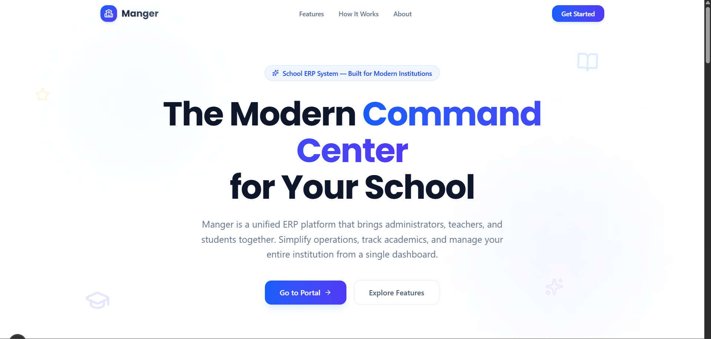
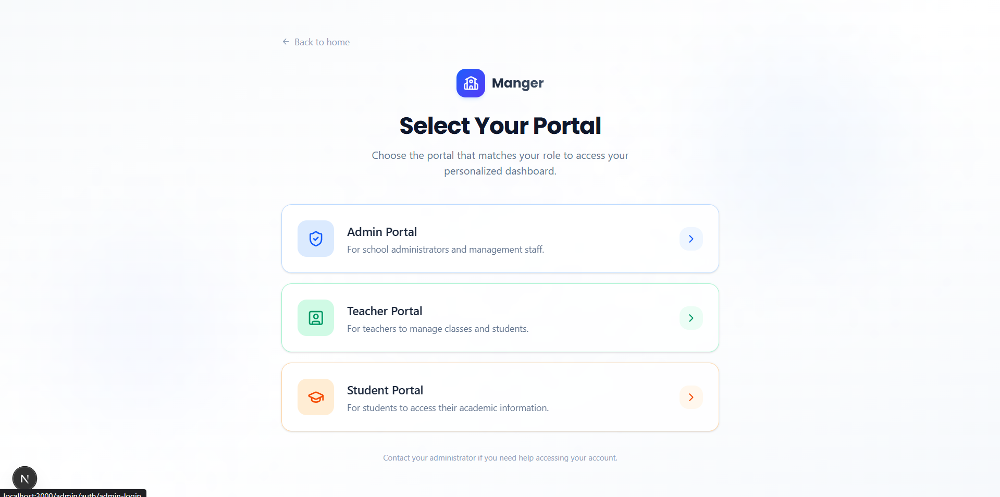
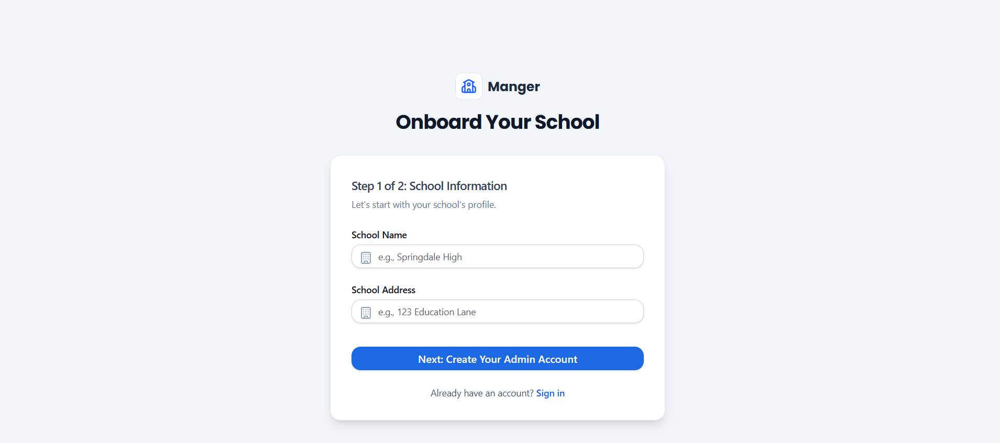
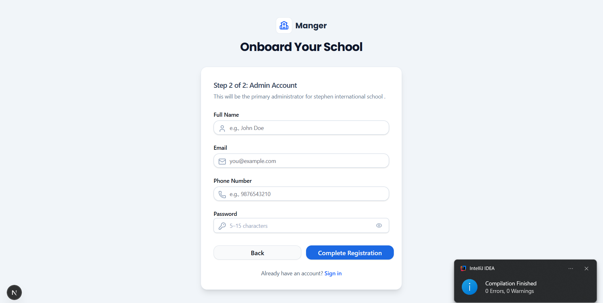
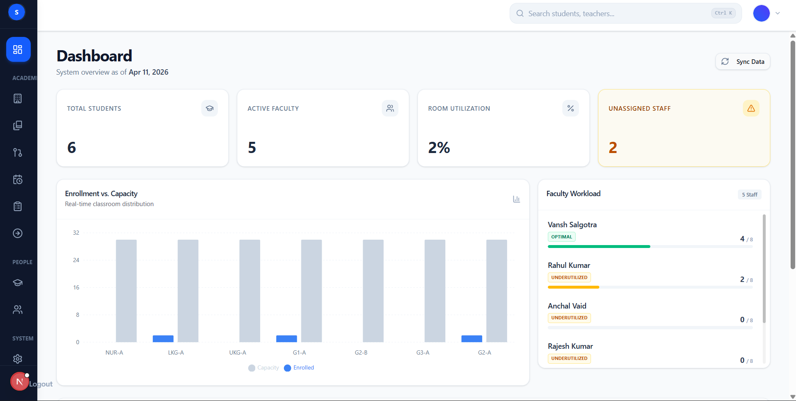
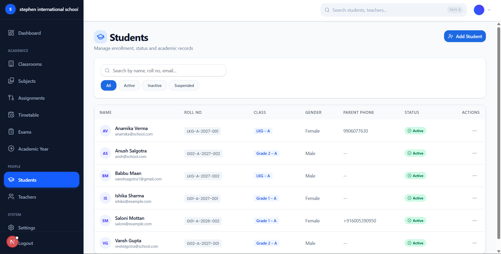
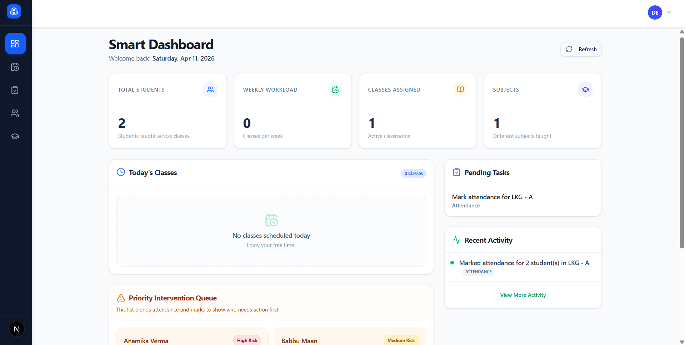
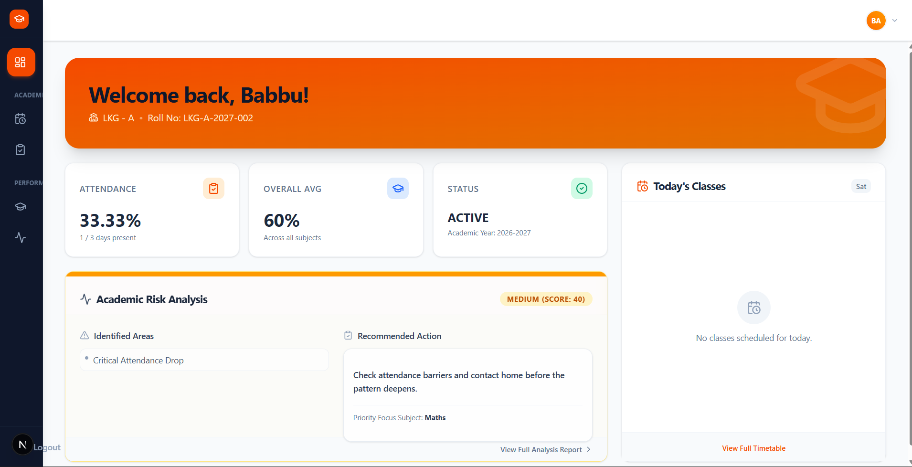
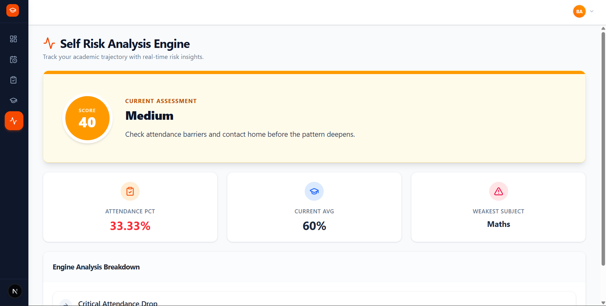

# Manger

Manger is a full-stack school ERP platform built around three separate portals: admin, teacher, and student. The project combines a Spring Boot REST API, a Next.js frontend, MySQL, JWT-based authentication, Cloudinary-backed media handling, PDF generation, and Docker-based local deployment.

The repo is organized around real school workflows instead of generic CRUD pages. Admins onboard a school, manage academic years, classrooms, subjects, teachers, students, exams, and timetables. Teachers work from their own dashboard to handle classes, attendance, marks, and student intervention. Students get a dedicated portal for timetable, attendance, exam results, profile data, and personal risk analysis.

## What the project covers

- Three dedicated role portals: admin, teacher, and student
- School onboarding flow that creates the initial institution and admin account
- Role-based JWT authentication with separate refresh flows for each portal
- School-scoped data isolation through tenant context and Hibernate filters
- Student, teacher, classroom, subject, attendance, exam, timetable, and academic-year management
- Dashboard views with KPIs, activity logs, workload summaries, and search
- Student risk analysis based on attendance and marks
- PDF generation for slips and marksheets
- OpenAPI / Swagger documentation for the backend API
- Docker Compose setup for frontend, backend, and MySQL

## Tech stack

| Layer | Stack |
| --- | --- |
| Frontend | Next.js 16, React 19, Tailwind CSS 4, Radix UI, Framer Motion, Axios, Recharts |
| Backend | Spring Boot 3.5, Spring Security, Spring Data JPA, Validation, Mail, OpenAPI |
| Database | MySQL 8 for main runtime, H2 for test profile |
| Auth | JWT access tokens, HTTP-only refresh cookies, role-based route protection |
| Media and documents | Cloudinary, OpenPDF |
| Tooling | Maven Wrapper, npm, Docker, Docker Compose |

## Role-based product flow

### Admin portal

- Register a school and create the initial admin account
- Access dashboard KPIs such as total students, active faculty, classroom utilization, and recent activity
- Manage students, teachers, subjects, classrooms, assignments, exams, timetable, and settings
- Track activity logs and use admin search features
- Configure academic years and promotion-related workflows

### Teacher portal

- View a daily dashboard with class schedule, pending tasks, and recent activity
- Mark attendance for assigned classrooms
- Enter marks and work with grading sheets
- Review weak-student intervention queues powered by the risk engine
- Access classroom details, timetable, exams, and profile information

### Student portal

- View personal profile and academic-year history
- Check attendance summary and monthly attendance records
- Open timetable and exam results
- Use the student-facing academic risk analysis screen
- Track academic status from a dedicated dashboard

## Backend domain map

- `academicyear` - academic year creation, status handling, and completion flow
- `attendance` - teacher attendance marking, queries, and attendance summaries
- `auth` - login, refresh, logout, registration, and password reset for all roles
- `classroom` - classroom setup, capacity management, and enrollment overview
- `dashboard` - admin KPIs, search, teacher workload, and activity feeds
- `exam` - exam lifecycle, subject mapping, marks entry, grading sheets, results, and marksheets
- `file` - file-serving endpoints
- `school` - school registration and school-level profile services
- `student` - admission, enrollment, portal data, risk analysis, and promotion flows
- `subject` - subject catalog and assignment management
- `teacher` - teacher lifecycle, assignments, dashboard, and profile services
- `timetable` - admin timetable management plus teacher and student timetable views
- `common` - shared security, configuration, DTOs, utilities, media storage, PDF generation, and activity logging

## Architecture notes

- The backend lives in [`Manger/`](Manger) and exposes role-scoped REST endpoints under `/api/admin`, `/api/teacher`, and `/api/student`.
- The frontend lives in [`frontend-manger/`](frontend-manger) and uses the Next.js App Router for all portal pages.
- Each role has its own frontend auth context and Axios client, with in-memory access tokens and HTTP-only refresh cookies.
- Tenant isolation is handled through `TenantContext`, `JwtAuthenticationFilter`, and a Hibernate `schoolFilter`, which keeps school data scoped to the authenticated user.
- Media uploads are handled through Cloudinary-backed services for school, teacher, and student assets.
- Swagger UI is enabled on the backend for API exploration.

## Project structure

```text
Mangerr/
|- Manger/                  # Spring Boot backend
|  |- src/main/java/com/vansh/manger/Manger/
|  |  |- academicyear/
|  |  |- attendance/
|  |  |- auth/
|  |  |- classroom/
|  |  |- common/
|  |  |- dashboard/
|  |  |- exam/
|  |  |- file/
|  |  |- school/
|  |  |- student/
|  |  |- subject/
|  |  |- teacher/
|  |  |- timetable/
|  |- src/main/resources/
|  |- pom.xml
|  |- mvnw / mvnw.cmd
|- frontend-manger/         # Next.js frontend
|  |- src/app/              # Admin, teacher, student, and public routes
|  |- src/components/
|  |- src/contexts/
|  |- src/lib/
|  |- package.json
|- docker-compose.yml
|- .env
```

## Recommended screenshots for GitHub

Store screenshots under `docs/screenshots/` and replace these notes with final image embeds when the assets are ready.

### 1. Public landing page

<!-- Screenshot: docs/screenshots/01-landing-page.png -->
Show the homepage hero section with the product message, CTA, and feature cards.

### 2. Role selection screen

<!-- Screenshot: docs/screenshots/02-role-selection.png -->
Show the admin, teacher, and student portal chooser.

### 3. School onboarding flow

<!-- Screenshot: docs/screenshots/03-school-onboarding.png -->
Capture the admin school registration flow, ideally step 1 and step 2 in a clean composite.

### 4. Admin dashboard

<!-- Screenshot: docs/screenshots/04-admin-dashboard.png -->
Show the KPI cards, enrollment chart, faculty workload panel, and recent activity table.

### 5. Admin management workspace

<!-- Screenshot: docs/screenshots/05-admin-management.png -->
Use either the students page, classrooms page, exams page, or timetable page to show day-to-day admin operations.

### 6. Teacher dashboard

<!-- Screenshot: docs/screenshots/06-teacher-dashboard.png -->
Show today's classes, pending tasks, recent activity, and the intervention queue.

### 7. Teacher marks or attendance screen

<!-- Screenshot: docs/screenshots/07-teacher-marks-or-attendance.png -->
Capture a screen that shows active academic work, such as mark entry, grading sheet, or attendance management.

### 8. Student dashboard

<!-- Screenshot: docs/screenshots/08-student-dashboard.png -->
Show the student overview with attendance, overall average, status, and today's classes.

### 9. Student risk analysis

<!-- Screenshot: docs/screenshots/09-student-risk-analysis.png -->
Capture the student-facing risk report with score, reasons, and recommended action.


## Local development setup

### Prerequisites

- Java 17
- Node.js 18 or newer
- npm
- MySQL 8
- A Cloudinary account for uploads
- SMTP credentials if you want OTP/password-reset email flows to work

### Backend configuration

The backend currently defaults to the `dev` profile through `Manger/src/main/resources/application.properties`.

For local development, update your backend configuration with your own values for:

- MySQL connection
- JWT secret
- Cloudinary credentials
- Mail username and password

You can do that in either of these ways:

1. Update `Manger/src/main/resources/application-dev.properties` for local development.
2. Switch to the `prod` profile and provide environment variables such as `SPRING_DATASOURCE_URL`, `SPRING_DATASOURCE_USERNAME`, `SPRING_DATASOURCE_PASSWORD`, `JWT_SECRET`, `SPRING_MAIL_USERNAME`, `SPRING_MAIL_PASSWORD`, `CLOUDINARY_CLOUD_NAME`, `CLOUDINARY_API_KEY`, and `CLOUDINARY_API_SECRET`.

Use your own credentials. Do not keep real secrets in a public repository.

### Frontend configuration

Create or update `frontend-manger/.env.local`:

```env
NEXT_PUBLIC_API_URL=http://localhost:8080
```

### Run the backend

```powershell
cd Manger
.\mvnw.cmd spring-boot:run
```

The backend runs on `http://localhost:8080`.

### Run the frontend

```powershell
cd frontend-manger
npm install
npm run dev
```

The frontend runs on `http://localhost:3000`.

## Docker setup

The root `docker-compose.yml` starts:

- MySQL
- Spring Boot backend
- Next.js frontend

Before running Docker Compose, update the root `.env` file with your own database, JWT, mail, and Cloudinary values.

Start everything with:

```powershell
docker compose up --build
```

Default ports:

- Frontend: `3000`
- Backend: `8080`
- MySQL: containerized in Compose

## API documentation

Once the backend is running, Swagger UI is available at:

```text
http://localhost:8080/swagger-ui/index.html
```

This is useful for testing role-based endpoints and understanding the REST surface before wiring new frontend features.

## Notes for contributors

- The frontend is split by route groups for public, admin, teacher, and student experiences.
- The backend uses package-based domain organization, which makes it easier to work on one business area at a time.
- Current automated test coverage is minimal, so manual verification still matters when changing flows.
- The project already contains Dockerfiles for both backend and frontend, which makes local packaging straightforward.

## Why this project is interesting

What makes this repo stand out is not just the number of modules. It already ties together school onboarding, school-scoped access control, multi-role UX, dashboard analytics, PDF exports, and a usable student risk engine in one codebase. It feels closer to a practical institution-management product than a starter CRUD project.
